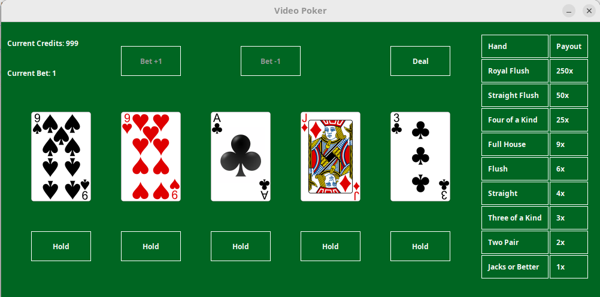

# VideoPoker
## 🚧 Project Status: Under Construction 🚧

### Overview
This is a Java-based implementation of **Jacks or Better Video Poker**, a popular casino game. The game is built using **Swing** for the graphical user interface (GUI) and follows the rules of traditional Jacks or Better poker. Players can place bets, hold cards, and draw new cards to form winning hands. The game calculates payouts based on the hand rankings.

### Features
- **Graphical User Interface**: Built with Java Swing for an interactive experience.
- **Game States**: The game follows a structured flow:
  1. Place a bet.
  2. Deal the initial 5-card hand.
  3. Hold 0-5 cards.
  4. Draw new cards for unheld positions.
  5. Evaluate the hand and calculate payouts.
- **Bankroll Management**: Tracks the player's credits and bets.
- **Hand Evaluation**: (To be implemented) Determines the player's winnings based on the final hand.

### GUI Mockup
</img>
### How to Play Jacks or Better Video Poker
1. **Start the Game**:
   - Launch the game by running the `Main` class.

2. **Place a Bet**:
   - Use the **Bet +1** and **Bet -1** buttons to adjust your bet.
   - The bet cannot exceed your current credits or go below 1.

3. **Deal the Initial Hand**:
   - Click the **Deal** button to receive your initial 5-card hand.
   - The game transitions to the **First Draw** state.

4. **Hold Cards**:
   - Click the **Hold** button below each card to hold it for the next draw.
   - Held cards will not be replaced during the second draw.

5. **Draw New Cards**:
   - Click the **Draw** button to replace unheld cards with new ones.
   - The game transitions to the **Final Draw** state.

6. **Evaluate the Hand**:
   - The game evaluates your final hand and calculates your winnings (based on the payout table).
   - Your winnings are added to your credits, and the game resets for the next round.

7. **Repeat**:
   - Continue playing until you run out of credits or decide to quit.

### Payout Table

| Hand               | Payout Multiplier |
|--------------------|-------------------|
| Royal Flush        | 250x             |
| Straight Flush     | 50x              |
| Four of a Kind     | 25x              |
| Full House         | 9x               |
| Flush              | 6x               |
| Straight           | 4x               |
| Three of a Kind    | 3x               |
| Two Pair           | 2x               |
| Jacks or Better    | 1x               |
