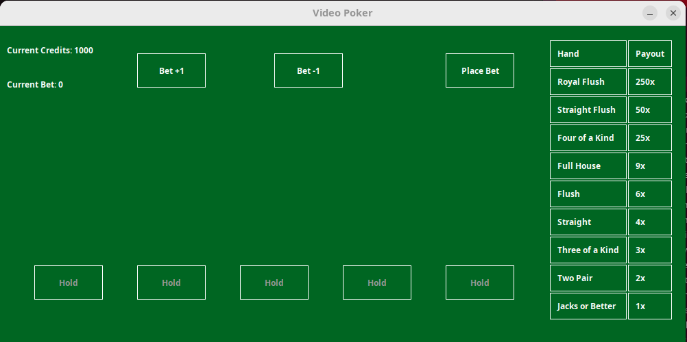
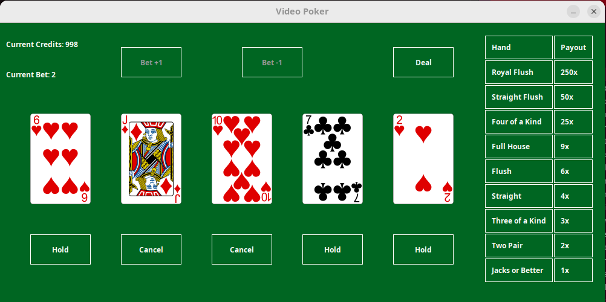
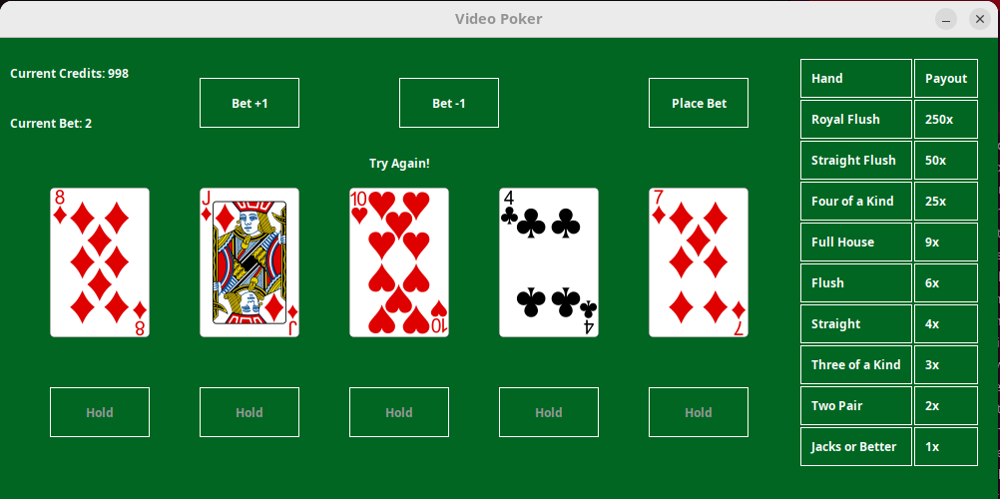

# VideoPoker
### Overview
This is a Java-based implementation of **Jacks or Better Video Poker**, a popular casino game. The game is built using **Swing** for the graphical user interface (GUI) and follows the rules of traditional Jacks or Better poker. Players can place bets, hold cards, and draw new cards to form winning hands. The game calculates payouts based on the hand rankings.

### Features
- **Graphical User Interface**: Built with Java Swing for an interactive experience.
- **Game States**: The game follows a structured flow:
  1. Place a bet.
  2. Deal the initial 5-card hand.
  3. Hold 0-5 cards.
  4. Draw new cards for unheld positions.
  5. Evaluate the hand and calculate payouts.
- **Bankroll Management**: Tracks the player's credits and bets.
- **Hand Evaluation**: (To be implemented) Determines the player's winnings based on the final hand.

### How to Play Jacks or Better Video Poker
1. **Start the Game**:

2. **Place a Bet**:
   - Use the **Bet +1** and **Bet -1** buttons to adjust your bet.
   - The bet cannot exceed your current credits or go below 1.
   </img>

3. **Deal the Initial Hand**:
   - Click the **Deal** button to receive your initial 5-card hand.
   - The game transitions to the **First Draw** state.

4. **Hold Cards**:
   - Click the **Hold** button below each card to hold it for the next draw.
   - Held cards will not be replaced during the second draw.
   </img>

5. **Draw New Cards**:
   - Click the **Draw** button to replace unheld cards with new ones.
   - The game transitions to the **Final Draw** state.

6. **Evaluate the Hand**:
   - The game evaluates your final hand and calculates your winnings (based on the payout table).
   - Your winnings are added to your credits, and the game resets for the next round.
   </img>

7. **Repeat**:
   - Continue playing until you run out of credits or decide to quit.

### Payout Table

| Hand               | Payout Multiplier |
|--------------------|-------------------|
| Royal Flush        | 250x             |
| Straight Flush     | 50x              |
| Four of a Kind     | 25x              |
| Full House         | 9x               |
| Flush              | 6x               |
| Straight           | 4x               |
| Three of a Kind    | 3x               |
| Two Pair           | 2x               |
| Jacks or Better    | 1x               |

### Example Hands
Here are some example hands to help you understand the different scoring combinations in Jacks or Better Video Poker:

1. **Royal Flush**  
   - **Hand**: Ace of Hearts, King of Hearts, Queen of Hearts, Jack of Hearts, Ten of Hearts  
   - **Description**: The highest-ranking hand, consisting of the top five cards in the same suit.  

2. **Straight Flush**  
   - **Hand**: Nine of Spades, Eight of Spades, Seven of Spades, Six of Spades, Five of Spades  
   - **Description**: Five consecutive cards of the same suit.  

3. **Four of a Kind**  
   - **Hand**: Four of Diamonds, Four of Hearts, Four of Clubs, Four of Spades, Nine of Hearts  
   - **Description**: Four cards of the same rank.  

4. **Full House**  
   - **Hand**: Three of Hearts, Three of Diamonds, Three of Clubs, Two of Spades, Two of Hearts  
   - **Description**: Three cards of one rank and two cards of another rank.  

5. **Flush**  
   - **Hand**: Ace of Clubs, Ten of Clubs, Seven of Clubs, Four of Clubs, Two of Clubs  
   - **Description**: Five cards of the same suit, not in sequence.  

6. **Straight**  
   - **Hand**: Ten of Diamonds, Nine of Clubs, Eight of Hearts, Seven of Spades, Six of Diamonds  
   - **Description**: Five consecutive cards of any suit.  

7. **Three of a Kind**  
   - **Hand**: King of Spades, King of Hearts, King of Diamonds, Eight of Clubs, Two of Hearts  
   - **Description**: Three cards of the same rank.  

8. **Two Pair**  
   - **Hand**: Jack of Clubs, Jack of Diamonds, Seven of Hearts, Seven of Spades, Ace of Diamonds  
   - **Description**: Two cards of one rank and two cards of another rank.  

9. **Jacks or Better**  
   - **Hand**: Queen of Hearts, Queen of Spades, Five of Diamonds, Three of Clubs, Two of Hearts  
   - **Description**: A single pair of Jacks, Queens, Kings, or Aces.
   
### Installation
   1. **Clone the Repository**:
      ```bash
      git clone https://github.com/AB1775/VideoPoker.git
      cd VideoPoker
      ```

   2. **Build the Project**:
      - Ensure you have Java installed.
      - Use your preferred build tool (e.g., Maven or Gradle) to build the project:
        ```bash
        mvn clean install
        ```
        or
        ```bash
        gradle build
        ```

   3. **Run the Game**:
      - Navigate to the `target` or `build` directory (depending on your build tool).
      - Execute the JAR file:
        ```bash
        java -jar VideoPoker.jar
        ```

   4. **Enjoy the Game**:
      - Follow the instructions in the "How to Play" section to start playing.
